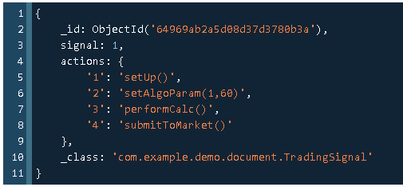

## Problem Statement
This project involves developing a Trading application that executes Trading Algorithms based on provided signals. The TradingApplication is expected to handle an increasing number in the future, with up to 50 new signals added monthly.

## Proposed Solution
Use NoSQL Database: Store the signal specifications in the database (e.g., MongoDB or ArangoDB). This allows for dynamic updates and avoids the need for code changes when new signals are added.

**_Example of signal configuration in MongoDB._**

## Implementation

The MethodMapBuilder provides the map of <actionName and action()> for the available methods in the external library.
Considering a large number of signals, the signal ID and corresponding actions-names are stored (as a document) in DB.
Per HTTP API request, the document (i.e., signal-ID and actions) retrieved from the database and employ the map produced by
MethodMapBuilder, enabling us to invoke each function for the given signal ID.

## Technical Debts (to-dos)
- The method in business logic which deals with the extraction of action name and argument from the configuration file, could be implemented in a more robust way. At the current implementation, a regular expression is employed to do this job which is maybe fragile because of the dynamic nature of action names and a number of arguments.
- More tests especially for checking the invocation of actions and order of execution are required.

## Challenges
- Making sure that the trading-action are executed in the correct order.
- Matching/extracting actions name and argument values.
- The capability of accepting a dynamic number of argument values for trading actions.

